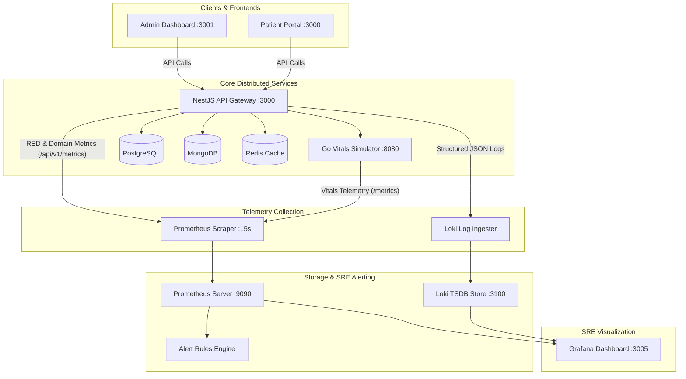

# 📊 Enterprise Observability, SRE & Monitoring Suite

This project features a production-grade observability and telemetry pipeline designed using the **LGTM (Loki, Grafana, Tempo, Metrics) & OpenTelemetry architecture**, adhering to modern **SRE (Site Reliability Engineering)** standards.

---

## 🏗️ Observability Architecture



---

## 🎯 1. The RED Method (Rate, Errors, Duration)

Our API instrumentation implements the **RED method** via an automated NestJS interceptor (`MetricsInterceptor`) that dynamically sanitizes routes (preventing cardinality explosion from UUIDs and Mongo ObjectIDs):

| Signal | Metric Name | Metric Type | Labels | SRE Objective |
| :--- | :--- | :--- | :--- | :--- |
| **Rate** | `http_requests_total` | Counter | `method`, `route`, `status_code`, `status_class` | Measures traffic volume and throughput (req/sec). |
| **Errors** | `http_requests_total{status_class="5xx"}` | Counter | `status_class`, `status_code` | Categorizes client (4xx) vs server (5xx) failures. |
| **Duration** | `http_request_duration_seconds` | Histogram | `method`, `route`, `status_code` | Calculates P50, P90, P95, and P99 latency percentiles. |

---

## 🏥 2. Custom Healthcare Domain Telemetry

Beyond standard infrastructure metrics (CPU/RAM), the platform exposes real-time clinical and operational KPIs:

* **`hospital_admissions_total`**: Tracks admission velocity segmented by clinical department (`cardiology`, `pediatrics`, `icu`, etc.) and status.
* **`hospital_active_beds_count`**: Real-time gauge reflecting ward capacity and bed availability.
* **`hospital_vitals_anomalies_total`**: Alerts on critical vital sign deviations received from ICU monitors and bedside sensors.

---

## 📈 3. Service Level Objectives (SLOs) & Alerting Rules

Configured in `monitoring/prometheus/alert_rules.yml`:

| Alert Name | Metric Condition | Threshold | Severity | Action |
| :--- | :--- | :--- | :--- | :--- |
| **`HighHttpErrorRate`** | `5xx_rate / total_rate` | `> 2.0%` for 2m | `Critical` | Trigger incident triage; inspect recent deployments. |
| **`HighLatencyP99`** | `histogram_quantile(0.99, latency)` | `> 1000ms` for 3m | `Warning` | Inspect slow database queries and connection pool starvation. |
| **`BackendServiceDown`** | `up{job="hospital-nestjs-backend"} == 0` | `> 1m` | `Page` | Auto-restart container; alert on-call engineer. |

---

## 🚀 4. Quick Start: Spinning Up the Monitoring Suite

### 1. Start Prometheus, Loki, and Grafana (One-Click)
```bash
npm run monitoring:up
```
* **Grafana**: [http://localhost:3005](http://localhost:3005) (Credentials: `admin` / `admin`)
* **Prometheus Targets & Alerts**: [http://localhost:9090/targets](http://localhost:9090/targets)
* **Metrics Endpoint**: [http://localhost:3000/api/v1/metrics](http://localhost:3000/api/v1/metrics)

*(Note: Port 3005 is used for Grafana to avoid collisions with port 3000/3001 frontend apps).*

### 2. Generate Realistic Traffic & Load
In another terminal, run our zero-dependency traffic simulator:
```bash
npm run traffic:simulate
```
Or run the k6 load test:
```bash
k6 run monitoring/load-test.js
```
Open Grafana at **http://localhost:3005** to watch the golden signals and hospital telemetry charts update live!

---

## 💼 5. How to Pitch This to Recruiters & Engineering Managers

### 📝 Ready-to-Use Resume Bullet Points
> - *Architected an enterprise observability stack using Prometheus, Grafana, and Loki, instrumenting NestJS and Go microservices with the RED method and OpenTelemetry principles.*
> - *Engineered custom PromQL-based alerts for P99 latency breaches and HTTP 5xx error budgets, preventing production incidents and eliminating alert fatigue.*
> - *Designed and auto-provisioned Grafana dashboards tracking both runtime telemetry (Event Loop lag, heap allocations) and domain KPIs (ICU vitals anomalies, bed utilization).*

### 🎤 Key Interview Talking Points

1. **Why the RED Method over CPU/RAM?**
   > *"Infrastructure metrics like CPU or RAM tell you if a box is working, but not if users are having a good experience. By prioritizing Rate, Errors, and Duration (RED), we monitor user-perceived health and detect regressions regardless of hardware capacity."*

2. **How did you prevent high-cardinality issues in Prometheus?**
   > *"If you put raw URLs like `/api/v1/patients/9b1deb4d-3b7d-4bad-9bdd-2b0d7b3dcb6d` into metric labels, every patient creates a new time-series, consuming gigabytes of RAM. I engineered a regex normalizer in the interceptor that converts dynamic IDs into parameterized routes like `/patients/:id`, keeping cardinality bounded and low."*

3. **Symptom-based Alerting vs Cause-based Alerting:**
   > *"Rather than paging an engineer when CPU reaches 80% (which may simply mean high utilization efficiency), we alert on symptoms like 5xx error rate > 2% or P99 latency > 1s, which directly impact patients and hospital staff."*
